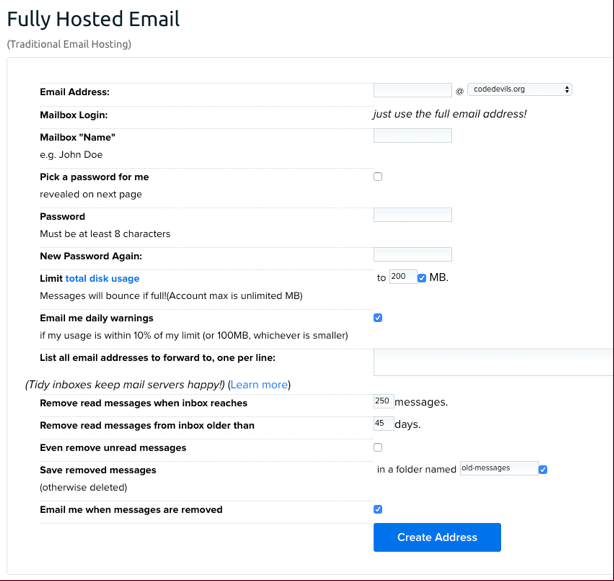
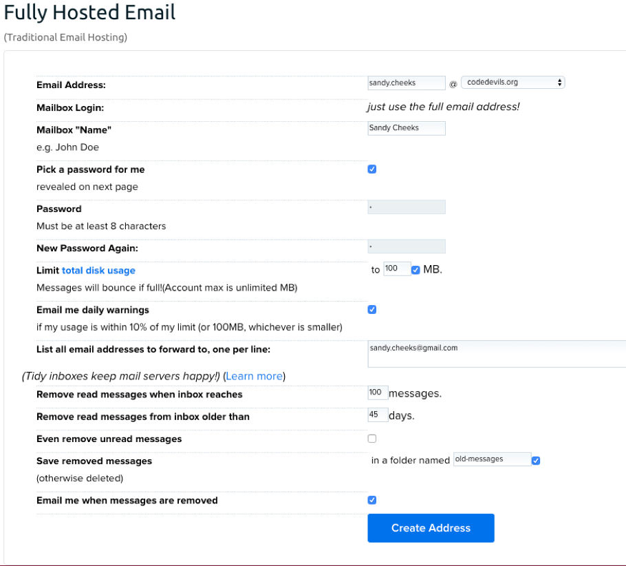
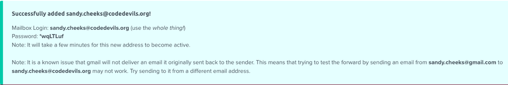
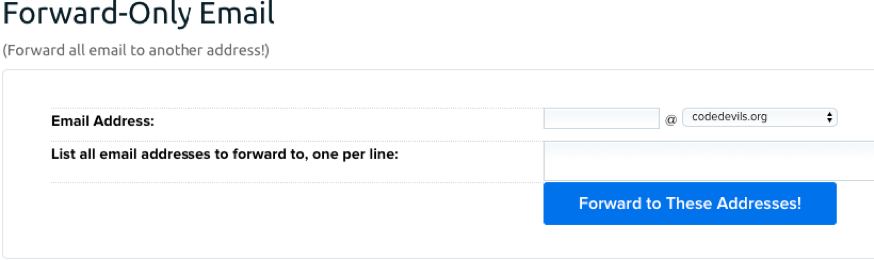
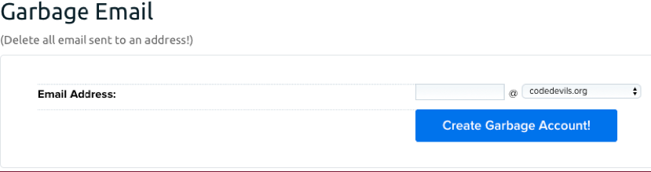
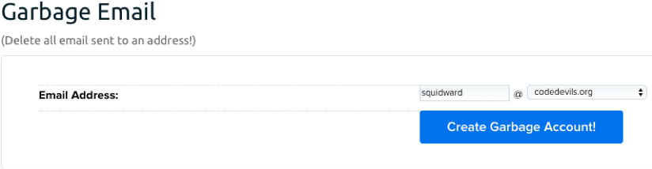
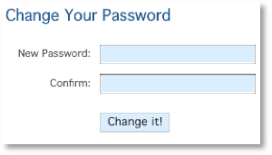
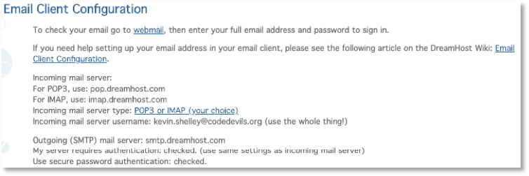
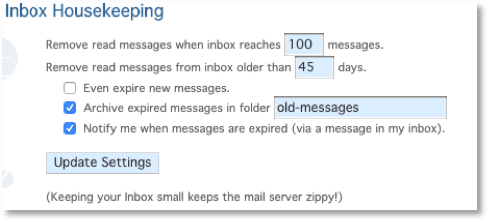
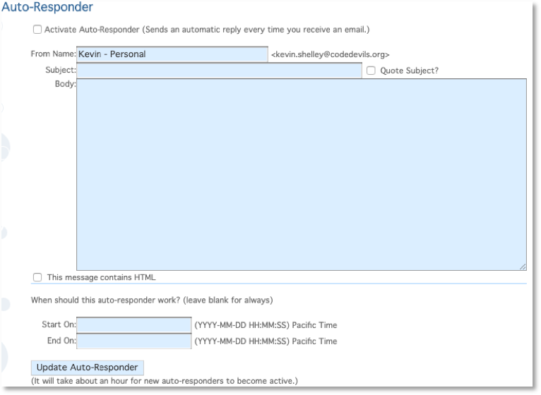

## Introduction
### Purpose

The Purpose of this technical document is to provide instructions on how to configure, manage and access CodeDevils&#39; emails through the DreamHost webmail interface.

### Acronyms and Abbreviations

| **Item** | **Description** |
| --- | --- |
| CD | CodeDevils |
| DHWI | DreamHost Webmail Interface |

## Email Configuration
### Inbox Creation/Configuration

Since there is limited server storage space (approximately 30GB at the time of writing this), the number and size of inboxes needs to be managed. The mail management panel can be found using [this link](https://panel.dreamhost.com/index.cgi?tree=mail.addresses) and signing in with the CD Gmail account (see a Webmaster for those credentials).

#### Fully Hosted Inboxes
##### Configuration

Fully hosted inboxes are assigned to individual members of CD. Each Officer is given a fully hosted email address, though they may decide to give another member access to an inbox. Fully hosted inboxes consume the most space on the server, and therefore must be created with constraints. The constraints will delete any email from oldest to newest if:

- There are more than 100 messages in the inbox
- An email is more than 45 days old

The exceptions are if the inbox is configured differently or messages are moved to a folder called _old\_messages_. Per the configuration outlined below, messages in this folder will not be deleted even after constraints have been met.

There is a size limitation set to 100MB of server storage space for each inbox. If this is not enough, the amount can be increased, but it is preferred that each owner of the fully hosted email have emails forwarded to their personal email address. Note that if the inbox reaches its max of 100MB of space, emails will bounce and the owner will not receive any emails from that inbox.

##### Creating a Fully Hosted Inbox
From _the_ mailbox manager page, select the  button. Navigate to the _Fully Hosted Email_ section, which will look like:

Fill in the respective fields with the following data:

- **Email Address** : The email address should be the first and last name of the user. Then, from the drop-down, select _codedevils.org_.
- **Mailbox &quot;Name&quot;** : Enter the person&#39;s first and last name (capitalizing the first letter of each)
- **Pick a Password for me** : Check this box. The password will appear on the next page. Note that when you check these boxes, the _Password_ and _New Password Again_ fields will gray out.
- **Limit total disk space** : Set to _100_
- **Email me daily warnings** : Keep the box checked. If the user opts to have their emails forwarded to their inbox, they will be notified if storage reaches 10% or is approaching 100MB.
- **List all emails to forward to, one per line** : Enter the owner&#39;s personal email address if they have given one. If there isn&#39;t one available, the field can be updated later.
- **Remove read messages when inbox reaches** : Set to _100_
- **Remove read messages from inbox older than:** Set to _45_ (should be the default)
- **Even remove unread messages:** Keep unchecked
- **Email me when messages are removed:** Keep unchecked. If the owner opted in to forwarding their emails, it will alert them when old messages have been deleted.

Now that all the fields are filled in, the inbox should look similar to this Sandy Cheeks example:

Select the 
 button once the form has been filled out. On the next page will be a confirmation message with the user&#39;s email and password:

A few minutes past this confirmation message, the email address will be ready to use.

#### Forward-only Email
##### Configuration

Forward-only emails are currently used for people outside of the organization and are normally the email addresses of each officer&#39;s position. Forward-only emails provide the benefit of creating a generic email address that an administrator can control and save space on the server that would otherwise be consumed by a fully-hosted email. It also helps in the transition of officers in and out of the organization. Rather than giving officers passwords to a position email, an administrator can simply have the email forward to another user.

##### Creating a Forward-only Email

From _the_ mailbox manager page, select the 
 button. Navigate to the _Forward-Only Email_ section, which will look like:

The fields are straight-forward:

- **Email Address:** The email address of the forward-only email. Be sure to select _codedevils.org_ from the drop-down if it is not the default.
- **List all email addresses to forward to, one per line:** Enter the list of all email addresses (at least one) to have the forward-only email address forward emails to.

Select the  button to save the forward-only email.

#### Garbage Email
##### Configuration

A garbage email will delete all messages that it receives. It should not be used by another CD member to send emails and is normally reserved for the web application server to send emails (since the web server cannot respond to emails).

##### Create a Garbage Email

From _the_ mailbox manager page, select the 
 button. Navigate to the _Forward-Only Email_ section, which will look like:

Enter the email address of the garbage email, and select _codedevils.org_ from the drop-down if it is not the default:

Select 

 to save the email address.

### Accessing an Inbox
#### DreamHost Webmail

The DHWI allows owners to view and respond to emails, as well as manage their inbox directly. The link to the webmail interface is:

[https://webmail.dreamhost.com/](https://webmail.dreamhost.com/)

To log in, the owner uses their email address and the password provided (or a custom email address if they changed it).

#### Inbox Management

Inbox management is a way for an owner of a fully-hosted inbox to change their password, manage their storage space and access the webmail interface. The link to the web management is:

[https://mailboxes.dreamhost.com/](https://mailboxes.dreamhost.com/)

The owner can log in using their email and password. The link is the same for all users, but the page will only display the owner&#39;s email that they logged in under. There are 7 sections to the management page.

##### Check Your Email on the Web

The link contained in this section leads to the webmail interface that is used to check and send emails.

##### Change Your Password

Change the inbox password by entering the new password in both fields.

##### Email Client Configuration

The client configuration dispalys the required information to allow the owner to use their inbox in a third-party email application (i.e. Gmail, Email App, Apple Mail, etc).

##### Inbox Housekeeping

Configuration settings can be changed by each owner, but these settings should only be managed by administrators. Changes to these fields need to be run by a webmaster before updating.

##### Junkmail Quarantine

The link contained in this section leads the owner of the inbox to a separate whitelisting page. The whitelisting page (known as the junkmail quarantine) acts as a filter and contains a list of emails addresses marked as &quot;whitelisted&quot; or &quot;blacklisted&quot;. Whitelisted emails are trusted email addresses whose content can be viewed safely. Blacklisted emails are blocked and filtered into a separate junk mail folder.

##### Email Filters

Email filters are a collection of rules that parse an incoming message and perform action based on logical criteria. It works just as any other email management system would, and allows you to create rules using the subject, who it was sent to, etc.

##### Auto-Responder

Incoming emails can be set to be responded to automatically for a time period. The automatic email is custom and supports HTML formatting.

